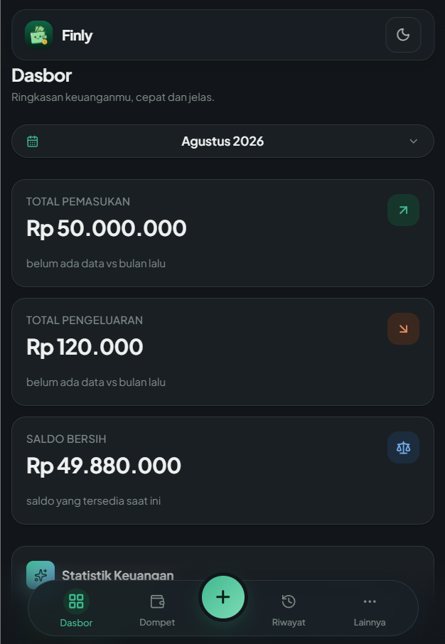
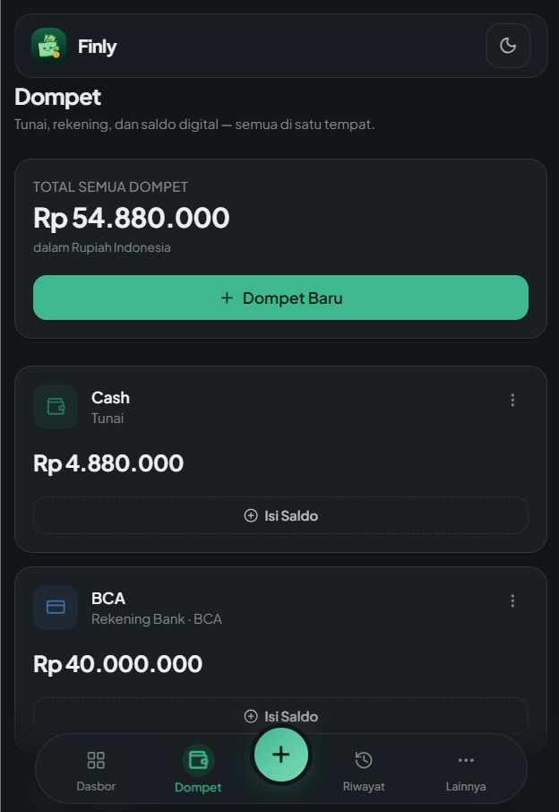
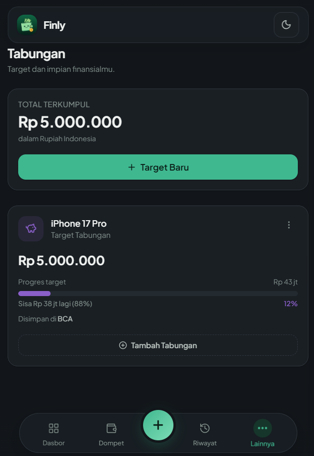
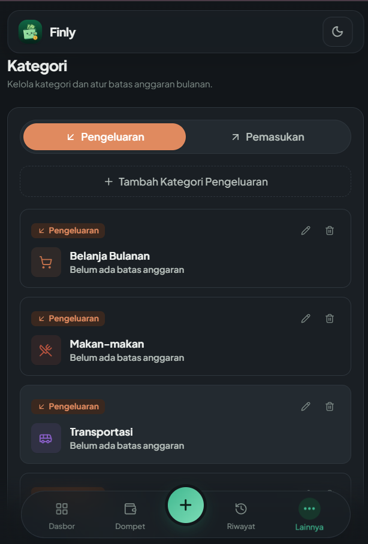
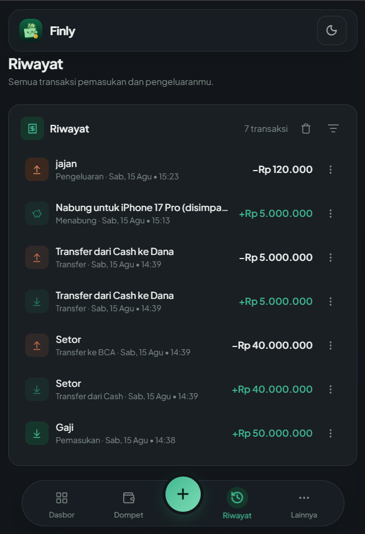

<div align="center">


# Finly

### Personal Finance & Budget Tracker Web App

<br/>

[](https://react.dev/)
[](https://www.typescriptlang.org/)
[](https://vitejs.dev/)
[](https://tailwindcss.com/)
[](./LICENSE)

<br/>

[**Screenshots**](#screenshots) · [**Features**](#features) · [**Tech Stack**](#tech-stack) · [**Getting Started**](#getting-started) · [**Project Structure**](#project-structure) · [**License**](#license)

</div>

<br/>

> [!NOTE]
> **Privacy-First & 100% Offline Capable** — Finly stores all your financial records directly in your browser's local storage. No external tracking, no backend database required, and full support for Excel (`.xlsx`) export/import.

---

<div align="center">

<h1><a id="screenshots"></a>📸 Screenshots</h1>

<br/>





<br/><br/>




</div>

---

<div align="center">

<h1><a id="features"></a>✨ Features</h1>

</div>

<table>
  <tr>
    <td width="50%" valign="top">

### 📊 Dashboard & Smart Insights
- **Total Income, Expense & Net Balance**: Instant real-time calculation with zero lag.
- **Daily Financial Trend Chart**: Interactive daily SVG graph tracking income and expense velocity.
- **Category Allocation Donut**: Dynamic 100% distribution chart with real-time center activity tracking.
- **Top Financial Badges**: Automatically detects and highlights your largest income and expense categories.

</td>
    <td width="50%" valign="top">

### 💳 Multi-Wallet Management
- **Universal Wallet Support**: Cash, Bank Accounts, and Digital E-Wallets.
- **Internal Wallet Transfers**: Move money between accounts with auto-formatted transfer history (`Transfer dari [A] ke [B]`).
- **Savings Integration**: Newly created savings goals automatically register as dedicated storage accounts in your wallets view.

</td>
  </tr>
  <tr>
    <td width="50%" valign="top">

### 🎯 Authentic Savings Goals
- **Progressive Goal Tracking**: Starts from 0% and dynamically calculates realized savings vs remaining deficits.
- **Goal Remaining Display**: Shows exact deficit needed (e.g. `Sisa Rp 9.000.000 lagi (90%)`).
- **Linked Funding**: Deposit funds into specific savings goals directly from your active cash or bank wallets.

</td>
    <td width="50%" valign="top">

### 📁 Backup & Excel Sync
- **Microsoft Excel (.xlsx) Export**: Export your complete financial ledger into beautifully formatted Excel sheets.
- **Instant Excel Restore**: Restore or migrate your accounts, categories, and transaction logs in one click.
- **Clean Reset Protocol**: Safely clear history while preserving your wallet and category structures.

</td>
  </tr>
  <tr>
    <td width="50%" valign="top">

### 🌐 Multi-Currency & Live Rates
- **International Currencies**: IDR, USD, EUR, SGD, JPY, MYR, GBP, AUD, CNY, and more.
- **Live Background FX Exchange**: Automatically syncs real-time exchange rates with offline fallbacks.
- **Bilingual Interface**: Seamless switching between **Bahasa Indonesia** and **English**.

</td>
    <td width="50%" valign="top">

### 🎨 Modern UX & Design System
- **Dual Themes**: Frosted Glassmorphism light mode and sleek OLED dark mode.
- **Hidden Scrollbars**: Clean, distraction-free native app feel with smooth touch ergonomics.
- **PWA Ready**: Installable on Android, iOS, Windows, and macOS as a standalone Progressive Web App.

</td>
  </tr>
</table>

---

<div align="center">

<h1><a id="tech-stack"></a>🛠️ Tech Stack</h1>

</div>

| Technology | Role | Description |
| :--- | :--- | :--- |
| **React 19** | Core UI | Declarative component framework with high rendering performance |
| **TypeScript 5.9** | Type Safety | End-to-end static type checking and zero runtime type errors |
| **Vite 7** | Build Engine | Ultra-fast HMR and optimized production bundle compilation |
| **Tailwind CSS 4** | Styling | Modern utility-first styling with custom HSL token variables |
| **Lucide Icons** | Visuals | Crisp, lightweight SVG iconography |
| **SheetJS (xlsx)** | Data Engine | Pure client-side Microsoft Excel workbook parser and serializer |
| **React Router 7** | Navigation | Client-side declarative URL hash routing |

---

<div align="center">

<h1><a id="getting-started"></a>🚀 Getting Started</h1>

</div>

### Prerequisites
- [Node.js](https://nodejs.org/) `v18.0.0` or higher
- [npm](https://www.npmjs.com/) `v9.0.0` or higher

### Installation & Local Setup

1. **Clone the repository:**
   ```bash
   git clone https://github.com/allzxy/Finly.git
   cd Finly
   ```

2. **Install dependencies:**
   ```bash
   npm install
   ```

3. **Start the local development server:**
   ```bash
   npm run dev
   ```
   Open your browser at `http://localhost:5173`.

4. **Build for production:**
   ```bash
   npm run build
   ```
   The compiled static bundle will be generated in the `dist/` directory.

---

<div align="center">

<h1><a id="project-structure"></a>📁 Project Structure</h1>

</div>

```text
Finly/
├── public/                 # Static assets, PWA webmanifest & icons
├── screenshots/            # App preview screenshots for documentation
├── src/
│   ├── components/         # Reusable UI components (Modals, Charts, Navbar, Cards)
│   ├── context/            # Global state context (Finance, Theme, Language, Toast)
│   ├── lib/                # Utilities, Currency FX rates, Excel sync, Types, Seeds
│   ├── pages/              # Primary routes (Dashboard, Wallets, Savings, History, Settings)
│   ├── App.tsx             # Application root layout and routes
│   ├── index.css           # Glassmorphism tokens, hidden scrollbars, & theme variables
│   └── main.tsx            # React application entry point
├── index.html              # HTML5 template
├── package.json            # Project dependencies and npm scripts
├── tsconfig.json           # TypeScript configuration
└── vite.config.ts          # Vite build settings
```

---

<div align="center">

<h1><a id="license"></a>📄 License</h1>

Released under the **MIT License**. See [LICENSE](LICENSE) for more information.

<br/>

<sub>Developed with ❤️ for effortless personal finance management.</sub>

</div>
